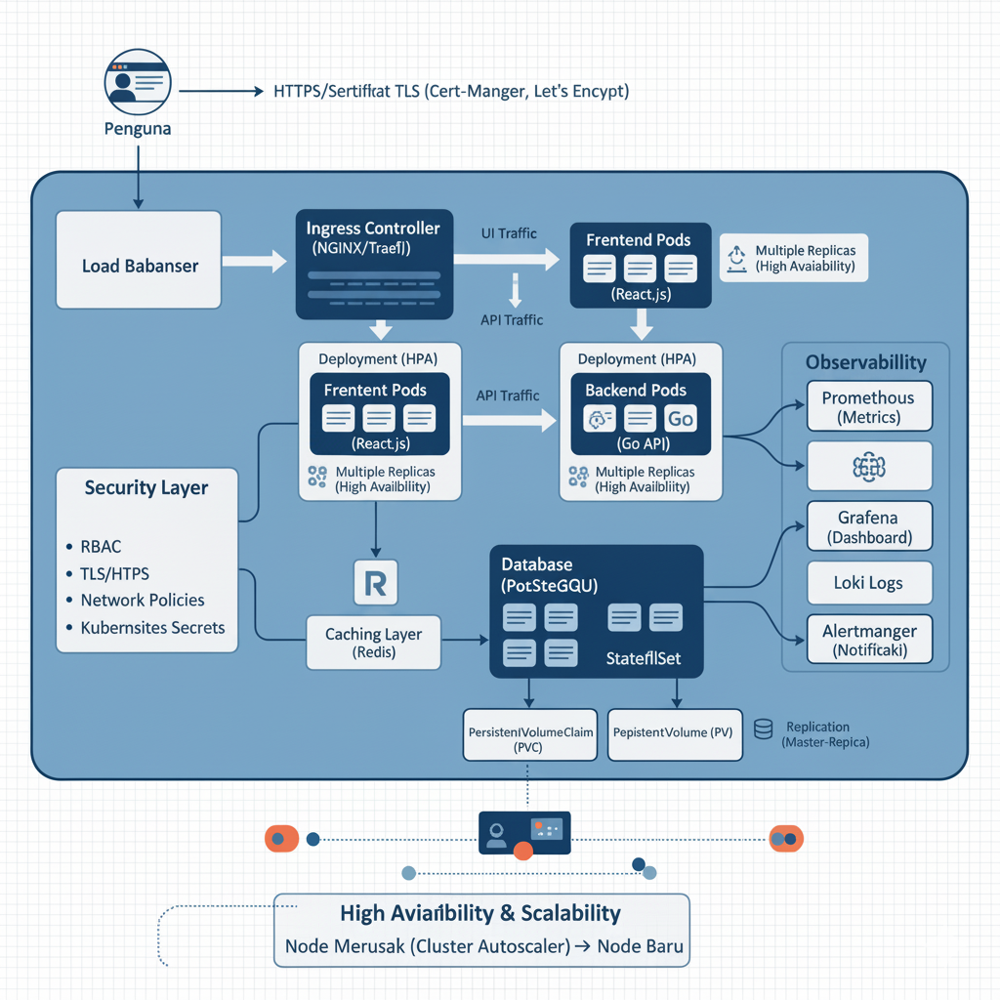

# TOOLING.md

## digram arsitektur aplikasi kubernetes

## 📌 Daftar Tools Open Source untuk Infrastruktur Kubernetes

### 1. **Kubernetes**
- **Kategori**: Orchestration & Container Management  
- **Alasan**: Kubernetes adalah standar industri untuk orkestrasi container. Mendukung auto-scaling, high availability, rolling updates, service discovery, dan self-healing, sehingga cocok untuk aplikasi dengan traffic tinggi dan tidak terprediksi.  

---

### 2. **NGINX Ingress Controller**
- **Kategori**: Networking / Traffic Routing  
- **Alasan**: Digunakan sebagai gateway HTTP/HTTPS untuk mengatur routing traffic dari luar ke dalam cluster. Mendukung TLS termination, load balancing, dan aturan routing yang fleksibel.  

---

### 3. **React.js (Frontend Framework)**
- **Kategori**: Frontend Development  
- **Alasan**: Library populer untuk membangun antarmuka pengguna interaktif. Open-source, didukung komunitas besar, dan mudah di-deploy sebagai static assets di Kubernetes.  

---

### 4. **Go (Backend Service)**
- **Kategori**: Backend Development Language  
- **Alasan**: Go ringan, cepat, dan efisien dalam penggunaan resource. Sangat cocok untuk aplikasi API dengan performa tinggi.  

---

### 5. **PostgreSQL**
- **Kategori**: Database  
- **Alasan**: Database relasional open-source yang stabil, kaya fitur, mendukung transaksi ACID, dan memiliki ekosistem luas (replication, failover, sharding). Cocok untuk data pengguna dan aplikasi skala besar.  

---

### 6. **Redis** (Opsional)
- **Kategori**: Caching / In-Memory Data Store  
- **Alasan**: Redis open-source, cepat, dan cocok untuk caching query, session, atau antrian. Membantu meningkatkan performa dengan mengurangi beban database utama.  

---

### 7. **Cert-Manager + Let’s Encrypt**
- **Kategori**: Security (TLS/SSL Certificates)  
- **Alasan**: Cert-Manager mengelola sertifikat TLS di Kubernetes secara otomatis. Let’s Encrypt menyediakan sertifikat gratis, sehingga semua traffic bisa dienkripsi tanpa biaya tambahan.  

---

### 8. **Kubernetes RBAC (Role-Based Access Control)**
- **Kategori**: Security / Access Management  
- **Alasan**: Digunakan untuk membatasi akses berdasarkan peran. Membantu memastikan bahwa setiap user atau service account hanya bisa mengakses resource yang dibutuhkan.  

---

### 9. **Kubernetes Network Policies**
- **Kategori**: Security / Network Isolation  
- **Alasan**: Membatasi komunikasi antar pod sesuai kebutuhan, sehingga mengurangi risiko lateral movement jika terjadi serangan.  

---

### 10. **Kubernetes Secrets**
- **Kategori**: Security / Credential Management  
- **Alasan**: Menyimpan data sensitif (seperti password database, API keys) dengan cara yang lebih aman daripada hardcoding di dalam aplikasi atau ConfigMap.  

---

### 11. **Prometheus**
- **Kategori**: Monitoring (Metrics Collection)  
- **Alasan**: Standar open-source untuk monitoring aplikasi dan cluster Kubernetes. Mendukung auto-discovery, metrics time-series, dan alerting berbasis query.  

---

### 12. **Grafana**
- **Kategori**: Visualization & Dashboard  
- **Alasan**: Open-source tool untuk membuat dashboard interaktif dari data Prometheus. Membantu developer & ops tim memahami performa aplikasi secara visual.  

---

### 13. **Loki**
- **Kategori**: Logging  
- **Alasan**: Open-source log aggregation system dari Grafana Labs. Ringan, hemat resource, dan terintegrasi langsung dengan Grafana untuk analisis log.  

---

### 14. **Alertmanager**
- **Kategori**: Alerting  
- **Alasan**: Bekerja bersama Prometheus untuk mengirimkan alert (via email, Slack, Telegram, dll.) ketika ada masalah (misalnya pod mati, CPU tinggi, database overload).  

---

### 15. **Kubernetes Horizontal Pod Autoscaler (HPA)**
- **Kategori**: Scaling  
- **Alasan**: Secara otomatis menambah/mengurangi jumlah pod berdasarkan metrics (CPU, memory, custom metrics). Membantu aplikasi menghadapi lonjakan traffic.  

---

### 16. **Kubernetes Cluster Autoscaler**
- **Kategori**: Scaling (Node Level)  
- **Alasan**: Menambah/mengurangi node secara otomatis sesuai kebutuhan pod. Cocok jika cluster berjalan di cloud (misalnya GCP, AWS, Azure).  

---

## 📄 Catatan
Penjelasan lengkap mengenai **flow arsitektur infrastruktur Kubernetes** sudah disediakan secara terpisah dalam file:  
**`infrastructure-flow.txt`**
